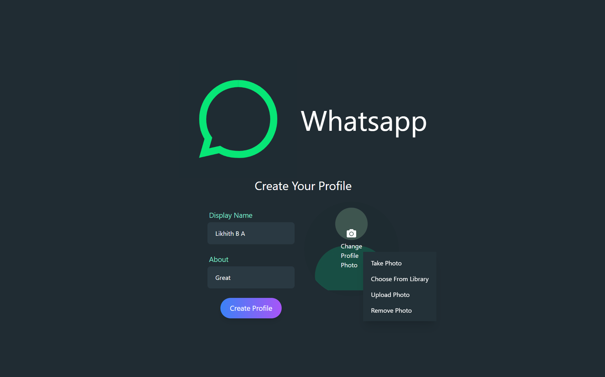
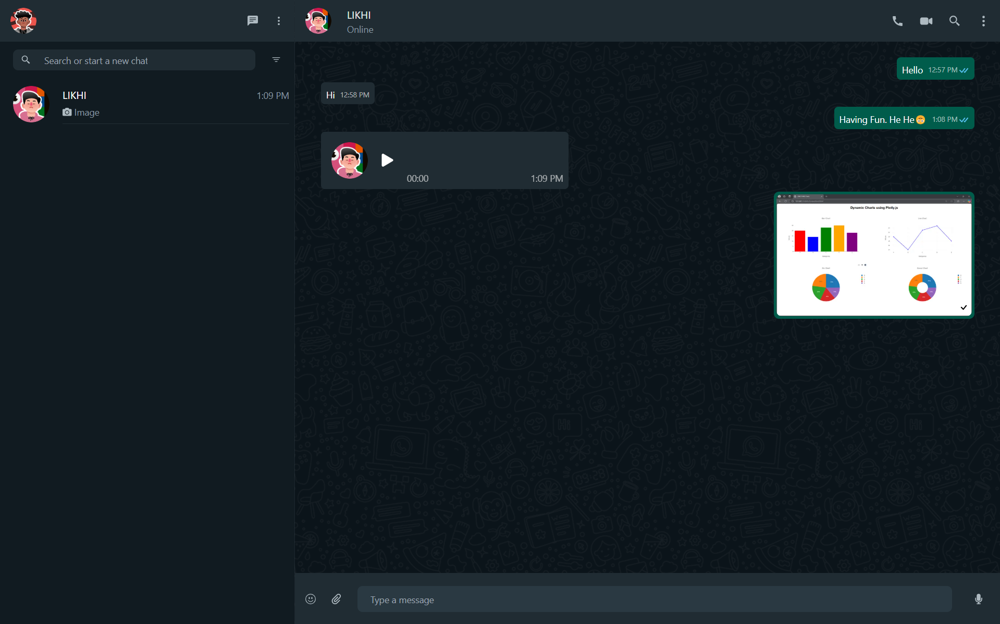

# Next.js Chat Application

A real-time messaging application that enables seamless text, audio, and video communication. Built with Next.js, Node.js, and MongoDB for a robust backend, it uses Socket.IO for instant messaging. This app connects users effortlessly, making conversations smooth and engaging.

## Features
- **Real-time Messaging** using Socket.IO
- **User Authentication** via Firebase
- **One-on-One Chats** with message status updates (Sent, Delivered, Read)
- **Voice & Video Calls** powered by ZegoCloud
- **Media Sharing** (Images & Audio messages) stored in Cloudinary
- **User Online Status Tracking**

## Tech Stack
- **Frontend:** Next.js, Tailwind CSS
- **Backend:** Node.js, Express.js, MongoDB, Socket.IO
- **Authentication:** Firebase
- **Real-time Communication:** Socket.IO, ZegoCloud
- **Media Storage:** Cloudinary

## Installation & Setup
### 1. Clone the Repository
```bash
git clone https://github.com/likhith-b-a/chat-app.git
cd chat-app
```

### 2. Install Dependencies
#### Client
```bash
cd client
npm install
```
#### Server
```bash
cd server
npm install
```

### 3. Configure Environment Variables
Create a `.env` file in both **client** and **server** directories with the following keys:

#### Client (.env.local)
```
NEXT_PUBLIC_HOST=http://localhost:5000
NEXT_PUBLIC_apiKey=your_firebase_api_key
NEXT_PUBLIC_authDomain=your_firebase_auth_domain
NEXT_PUBLIC_projectId=your_firebase_project_id
NEXT_PUBLIC_ZEGO_APP_ID=your_zegocloud_app_id
NEXT_PUBLIC_ZEGO_SERVER_SECRET=your_zegocloud_server_id
```

#### Server (.env)
```
PORT=5000
MONGODB_URI=your_mongodb_connection_string
DB_NAME=your_database_name
CORS_ORIGINS=your_allowed_origins_separated_by_comma
CLOUDINARY_CLOUD_NAME=your_cloudinary_cloud_name
CLOUDINARY_API_KEY=your_cloudinary_api_key
CLOUDINARY_API_SECRET=your_cloudinary_api_secret
ZEGO_APP_ID=your_zegocloud_app_id
ZEGO_SERVER_ID=your_zegocloud_server_id
```

### 4. Start the Application
#### Start the Server
```bash
cd server
npm start
```
#### Start the Client
```bash
cd client
npm run dev
```

## Usage
- **Login/Register** using Firebase Authentication
- **Start a Chat** with any registered user
- **Send Messages** in real-time with status updates
- **Make Audio/Video Calls** with ZegoCloud
- **Share Images & Audio Messages**

## API Routes
| Method | Endpoint | Description |
|--------|---------|-------------|
| POST   | `/api/auth/onboard-user` | Register a new user |
| POST   | `/api/auth/check-user` | Authenticate user |
| GET   | `/api/auth/getUsers` | Get all the users |
| GET    | `/api/messages/:from/:to` | Fetch chat messages between two users |
| POST   | `/api/messages/addMessage` | Send a new message |
| POST   | `/api/messages/add-image-message` | Upload an image message |
| POST   | `/api/messages/add-audio-message` | Upload an audio message |
| GET   | `/api/messages/get-initial-contacts/:from` | Get the Contacts |

## Screenshots
### On-Boarding


### Chat Interface


## Contributors & Acknowledgments
- Developed by **Likhith B A**
- Inspired by **WhatsApp Clone**

---
This **Next.js Chat Application** is a scalable and feature-rich real-time messaging platform designed to provide a seamless communication experience.
